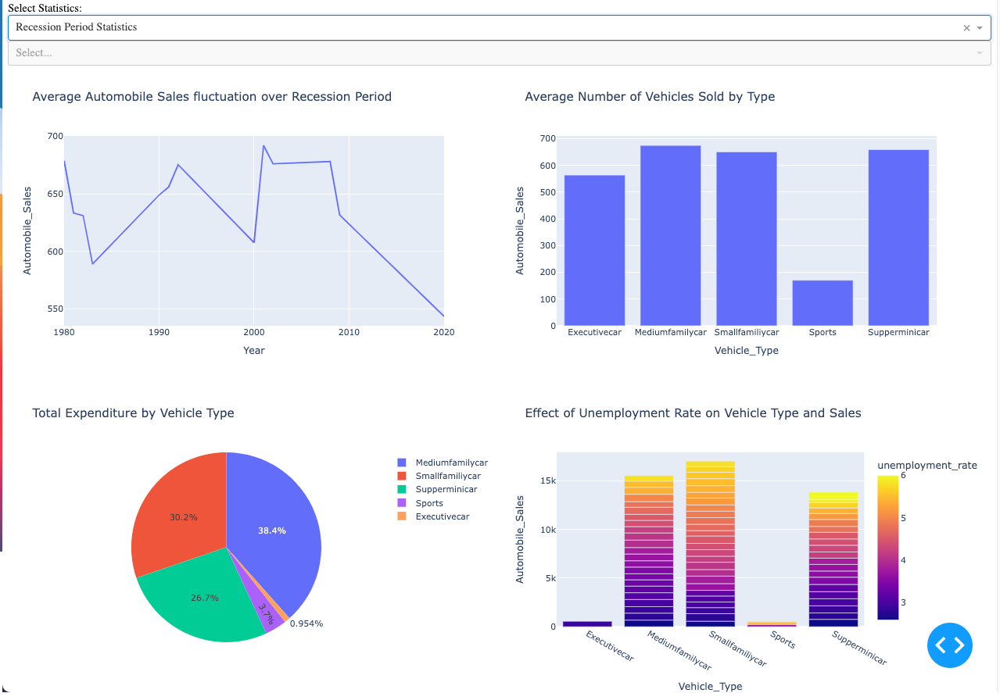

# Analyzing the Impact of Recession on Automobile Sales
Analyzing the Impact of Recession on Automobile Sales

Let's say you have been hired by an automobile company as a data scientist. Your first task is to analyze the historical data and give the company directors insights on how the sales were affected during times of recession. You will provide a number of charts/plots to visualize the data and make it easy for the directors to understand your analysis.

# About The Dataset

The dataset includes the following variables:

* Date: The date of the observation.
* Recession: A binary variable indicating recession perion; 1 means it was recession, 0 means it was normal.
* Automobile_Sales: The number of vehicles sold during the period.
* GDP: The per capita GDP value in USD.
* Unemployment_Rate: The monthly unemployment rate.
* Consumer_Confidence: A synthetic index representing consumer confidence, which can impact consumer spending and automobile purchases.
* Seasonality_Weight: The weight representing the seasonality effect on automobile sales during the period.
* Price: The average vehicle price during the period.
* Advertising_Expenditure: The advertising expenditure of the company.
* Vehicle_Type: The type of vehicles sold; Supperminicar, Smallfamiliycar, Mediumfamilycar, Executivecar, Sports.
* Competition: The measure of competition in the market, such as the number of competitors or market share of major manufacturers.
* Month: Month of the observation extracted from Date.
* Year: Year of the observation extracted from Date.
* 
 By examining various factors mentioned above from the dataset, you aim to gain insights into how recessions impact automobile sales for your company.

